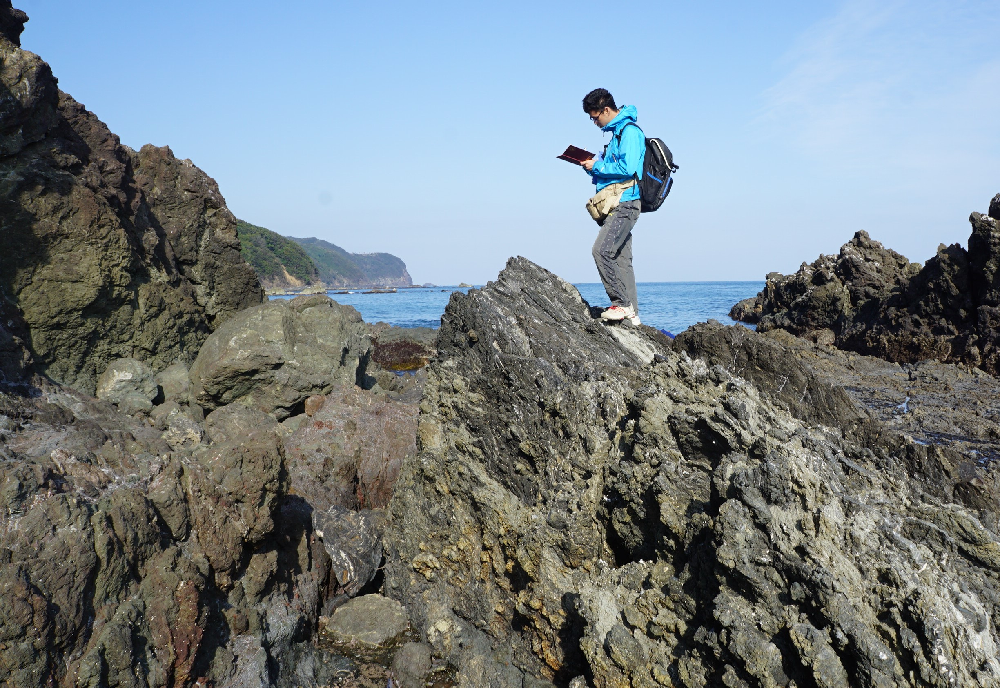

# Welcome to Hanaya Okuda's Page!
### I am a Ph.D. student at University of Tokyo, Japan, who is interested in rock mechanics and earthquakes.

 
*On the oceanic crust... (March 2020 at Mugi mélange)*

***
## *News*
- 2020.08.26: \[<a href="https://hanayaokuda.github.io/MyPage/publications">Publication</a>\] Okuda, Katayama, Sakuma, Kawai (under review) is available in Solid Earth preprint.

- 2020.07.15: \[<a href="https://hanayaokuda.github.io/MyPage/presentations">Presentation</a>\] Okuda, Katayama et al. will present iPoster at S-CG69, JpGU-AGU Joint meeting 2020. 

- 2020.07.13: \[<a href="https://hanayaokuda.github.io/MyPage/presentations">Presentation</a>\] Okuda, Ikari et al. will present iPoster at S-CG57, JpGU-AGU Joint meeting 2020. 

- 2020.06.01: \[<a href="https://hanayaokuda.github.io/MyPage/publications">Publication</a>\] Okuda (2020) was published in Supercomputing News (non-peer-reviewed, in Japanese).

- 2020.04.01: \[<a href="https://hanayaokuda.github.io/MyPage/CV.html">CV</a>\] I started my Ph.D. life at Dept. Ocean Floor Geoscience, Atmosphere and Ocean Research Institute (AORI), University of Tokyo, Japan.

- 2020.03.31: \[<a href="https://hanayaokuda.github.io/MyPage/CV.html">CV</a>\] I earned Master of Science degree and graduated from Dept. Earth and Planetary Science, School of Science, University of Tokyo, Japan.

- 2019.09.06: \[<a href="https://hanayaokuda.github.io/MyPage/publications">Publication</a>\] Okuda, Kawai, Sakuma (2019) was published in JGR: Solid Earth.
